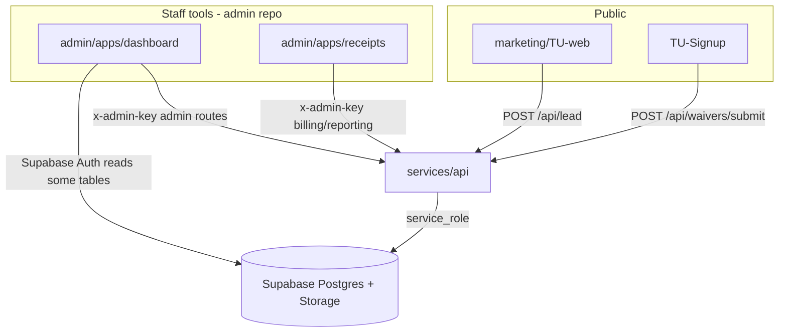

# API capability audit — notifications, finance, scheduling

**Date:** 2026-06-01 (updated; original audit 2026-05-29)  
**Scope:** `services/api` (deployed Express backend) vs `supabase/migrations/` (schema source of truth) vs front-ends (`admin/apps/receipts`, `admin/apps/dashboard`, `marketing/TU-web`, `TU-Signup`).  
**Companion docs:** [admin-api.md](./admin-api.md) (route contracts), [api-schema-audit.md](./api-schema-audit.md) (live DB alignment), [finance-subsystem-design.md](./finance-subsystem-design.md), [receipts-app.md](./receipts-app.md), [v1-v2-application-map.md](./v1-v2-application-map.md).

---

## Executive summary

| Area | Schema | API writes | API reads / automation | Operator UI today |
|------|--------|------------|------------------------|-------------------|
| **Notifications** | Views for reminders; no `notifications` table | Webhook fan-out only (Discord/Slack) | Admin **POST** triggers for Discord reminders/digest; waiver submit auto-notify | No in-app notification center; staff channel = Discord |
| **Finance / receipts** | Full billing + receipts + personal log + expenses (through **0019** on live) | Rich `/api/admin/billing/*` + reporting | No payment processor; no scheduled invoice reminders in API yet | `admin/apps/receipts` — personal log + formal billing **ready** (0017–0019 applied) |
| **Scheduling** | `schedule_templates`, `sessions`, `attendance_records`, entitlements | **Session + attendance CRUD** via `/api/admin/scheduling/*` (Tier 1, PR #11) | Reporting views + entitlement check on attendance; billing RPC from attendance | Dashboard still reads `sessions` via **direct Supabase**; marketing schedule is **static config** |

**Schema sync:** Production includes migrations **0017–0020** (confirmed 2026-06-01 via
`list_migrations`). Repo and live DB are fully aligned through **0020**; next work is
**smoke-testing** finance, scheduling, and subscription endpoints. See
[api-schema-audit.md](./api-schema-audit.md).

**Recommended iteration order:**

1. Smoke-test finance + waiver paths (`admin/apps/receipts` cash/invoice/discount tabs; personal-finance API routes).
2. Smoke-test Tier 1 scheduling + subscription enrollment routes.
3. Wire **scheduled** calls to existing Discord notification routes (Render cron or external scheduler).
4. Harden **record-payment** and waiver submit with atomic RPCs or idempotency keys.
5. V2: payment processor webhooks, member pay links, email/SMS delivery (not just share-sheet text).

---

## 1. How the API fits the monorepo



**Design rule:** Browser apps should **not** embed the service-role key. Writes that enforce business rules go through the API (or documented RPCs invoked by the API). The dashboard still reads `sessions` directly today — that is an intentional gap for scheduling.

---

## 2. Notifications

### 2.1 What exists today

There is **no** first-class `notifications` table, push service, or email-to-member pipeline. Notifications are **outbound webhooks** to staff channels plus **client-side share text** for finance.

| Mechanism | Trigger | Channel | Fails submission? |
|-----------|---------|---------|-------------------|
| Waiver submitted | `POST /api/waivers/submit` (after DB persist) | Discord and/or Slack if env set | **No** — logged, submission still succeeds |
| Payment reminders | `POST /api/admin/notifications/discord/payment-reminders` | Discord (`DISCORD_WEBHOOK_URL`) | N/A (admin-only) |
| Daily digest | `POST /api/admin/notifications/discord/daily-digest` | Discord | N/A |
| Receipt / invoice “send” | Operator action in `admin/apps/receipts` | **Copy/share sheet** (SMS, Messages, etc.) — not API email | N/A |

**Implementation files:**

- `services/api/src/services/notifications/notifyWaiverSubmitted.js` — builds message, fans out to Discord/Slack.
- `services/api/src/routes/admin/notifications.js` — payment reminders + daily digest from `view_member_payment_reminders` and `marketing_leads`.
- `services/api/src/services/discord.js` — low-level webhook POST for admin routes.

**Data sources for billing alerts:**

- `view_member_payment_reminders` — buckets `overdue` and `due_soon` (due within 3 days), with `name`, `next_due_date`, `actual_price`, `days_late`.

### 2.2 What is not implemented (V1 product intent)

From [v1-v2-application-map.md](./v1-v2-application-map.md):

- **Scheduled** jobs that call the Discord routes (e.g. morning digest, instant overdue/due-soon) — routes exist; **nothing in-repo cron** invokes them yet.
- **Telegram / WhatsApp** — not in code.
- **Personal invoice due reminders** — planned in [receipts-app.md](./receipts-app.md) (nightly scan of `personal_finance_entries` with `invoice_status = sent`); **no API route** yet.
- **Member-facing** notification preferences — V2.

### 2.3 Notifications ↔ schema

| DB object | Used by notifications? |
|-----------|-------------------------|
| `view_member_payment_reminders` | Yes — Discord admin routes |
| `marketing_leads` | Yes — 24h count in daily digest |
| `event_ledger` | Indirect — waiver path records `waiver.submitted`; not used to drive Discord today |
| `personal_finance_entries` | **No** — invoice due automation not built |

---

## 3. Financial subsystem (receipts / bookkeeping)

### 3.1 Product intent vs implementation

**Intent:** Manual accounting log now; formal billing when UUIDs are known; share receipts/invoices to people via operator’s phone; later payment processor (replace Intuit GoPayment).

**Two layers** (see [finance-subsystem-design.md](./finance-subsystem-design.md)):

| Layer | Tables | API | Receipts app tabs |
|-------|--------|-----|-------------------|
| **Personal log** | `personal_finance_entries` | `POST/GET .../personal-finance-entries`, `POST .../:id/invoice-status` | Cash log, Invoice, Recent |
| **Formal billing** | `payments`, `payment_allocations`, `charges`, `receipts`, `payment_refunds` | `record-payment`, void/issue-for-refund, refunds, discounts, RPCs | Formal, Lookup, Void, Refund |

**Sharing receipts/invoices:** Implemented in the **UI** (`admin/apps/receipts/src/lib/shareFormats.ts`) as plain-text templates for the device share sheet — **not** `POST /send-email` or similar. “Send invoice” today means: create row → mark `invoice_status` → operator copies text to SMS.

### 3.2 Finance API surface (admin)

All routes under `/api/admin` with `x-admin-key`. Full request/response shapes: [admin-api.md](./admin-api.md).

| Capability | Endpoint(s) | Schema / RPC |
|------------|---------------|--------------|
| Quick cash log | `POST/GET /billing/personal-finance-entries` | `personal_finance_entries` (**0017**) |
| Invoice drafts + status | same + `POST .../:id/invoice-status` | `entry_kind = invoice`, statuses `draft\|sent\|paid\|void` |
| Record payment + optional money-in receipt | `POST /billing/record-payment` | `payments`, `payment_allocations`, `receipts`, `view_charge_net` |
| Void receipt | `POST /billing/receipts/:id/void` | `receipts` soft void |
| Money-out receipt for refund | `POST /billing/receipts/issue-for-refund` | `payment_refunds`, `receipts` |
| Refund member payment | `POST /billing/payment-refunds` | RPC `record_payment_refund` |
| Charge write-off | `POST /billing/charge-adjustments` | `charge_adjustments` |
| Charge discounts | `GET/POST /billing/charge-discounts` | `charge_discounts`, discount-aware `view_charge_net` (**0019**) |
| Subscription enrollment | `POST /billing/subscriptions` | RPC `create_subscription` (**0020**) |
| Subscription upgrade (prorated) | `POST /billing/subscription-upgrade` | RPC `upgrade_subscription_prorated` |
| Per-class charge from attendance | `POST /billing/per-class/charge-from-attendance` | RPC `create_pay_per_class_charge` |
| Upgrade per-class → monthly | `POST /billing/per-class/upgrade-to-monthly` | RPC `upgrade_per_class_to_monthly` |
| External walk-in payer | `POST /billing/external-counterparty-accounts` | `accounts` insert |
| Operating expenses | `GET/POST /billing/operating-expenses` | `operating_expenses` (**0016**) |
| Marketing leads list | `GET /billing/marketing-leads` | `marketing_leads` |
| Participant search (finance) | `GET /participants/search` | `participants`, `account_members`, `accounts` |
| Payment board / KPIs | `GET /reporting/views/:slug`, `GET /finance/monthly-summary` | 19 whitelisted views |

**Formal billing in production:** Schema supports receipts (`0014`), but live data shows **0 charges / 0 payments / 0 receipts** — paths are implemented, not yet exercised operationally.

**Known gap (by design):** Personal invoice rows do **not** auto-create `charges`. Linking draft → formal charge is future work ([receipts-app.md](./receipts-app.md)).

**Known gap (engineering):** `record-payment` is **not transactional** — partial failure can leave a payment without full allocations/receipt. Recommendation: single RPC `record_payment(...)`.

**Not implemented:** Payment processor webhooks, member pay links, PDF/email receipt delivery from API, Intuit replacement.

### 3.3 Finance ↔ schema (repo migrations)

| Migration | Objects | API dependency |
|-----------|---------|----------------|
| 0001–0012 | Core billing, sessions, attendance, views | Most billing + reporting |
| 0014 | `receipts`, receipt event capture | record-payment, void, issue-for-refund |
| 0015 | `marketing_leads` | lead route + digest |
| 0016 | `operating_expenses` | operating-expenses routes |
| **0017** | `personal_finance_entries` | personal-finance routes — **applied** |
| **0018** | private schema grants | waiver event capture — **applied** |
| **0019** | `charge_discounts`, `view_charge_net` update | charge-discounts routes — **applied** |
| **0020** | `sessions.cancelled_at`, `create_subscription` RPC | scheduling routes + subscription enrollment — **applied** |

### 3.4 What `admin/apps/receipts` needs from the API

Documented in [receipts-app.md](./receipts-app.md). Every feature maps to an existing admin route **except** automated Discord reminders for personal invoices (planned, not built).

**Value of API for receipts:** Centralizes service-role access, validation, RPC calls, and consistent `{ ok, error }` envelope — receipts app is a thin operator client.

---

## 4. Scheduling

> **CRUD** stands for **Create, Read, Update, Delete** — the four basic operations on
> stored data. In this API, "Delete" for sessions is implemented as a **soft cancel**
> (`cancelled_at` timestamp) so attendance history is retained rather than hard-deleted.

### 4.1 Your mental model vs the codebase

You described: participants → programmatic classes (e.g. "Class 1, 7–9am") → applicants A/B/C assigned. **The database model supports this**, and **Tier 1 admin APIs now expose session and attendance CRUD** (migration `0020`, PR #11). Template management and batch session generation are still future work.

### 4.2 Schema (exists)

From `0001_foundation_schema.sql` and later views:

| Table | Role |
|-------|------|
| `schedule_templates` | Recurring patterns (e.g. weekly class slots) |
| `sessions` | Concrete instances (`starts_at`, `ends_at`, `session_label`, optional `schedule_template_id`, `cancelled_at`) |
| `attendance_records` | Participant ↔ session (`status`, etc.) — drives group entitlement consumption |
| `private_usage`, `entitlement_credits`, `access_overrides` | Private minutes, bonuses, overrides |
| `plan_entitlements`, `subscriptions` | What a member is allowed to attend |

**DB helpers called from API routes:** `can_attend_group_session(participant_id, session_label)` on attendance upsert (optional entitlement enforcement). `generate_monthly_charges()` is still manual/future automation only.

### 4.3 API touchpoints for scheduling

#### Session + attendance CRUD (Tier 1 — implemented)

| Endpoint | CRUD op | What it does |
|----------|---------|--------------|
| `GET /api/admin/scheduling/sessions` | **Read** | List/filter sessions (date range, label, include cancelled) |
| `GET /api/admin/scheduling/sessions/:sessionId` | **Read** | Session detail + attendance rows |
| `POST /api/admin/scheduling/sessions` | **Create** | New session (label, start, end, optional template) |
| `PATCH /api/admin/scheduling/sessions/:sessionId` | **Update** | Reschedule, edit notes, soft-cancel (`cancel: true` → `cancelled_at`) |
| `POST /api/admin/scheduling/sessions/:sessionId/attendance` | **Create/Update** | Upsert attendance for participant list (entitlement check optional) |

Full request/response contracts: [admin-api.md](./admin-api.md) § Scheduling.

#### Reporting + billing (read-heavy / downstream)

| Endpoint | What it does |
|----------|--------------|
| `GET /api/admin/reporting/views/today-sessions` | `view_ops_today_sessions` — day-of board (excludes cancelled) |
| `GET /api/admin/reporting/views/upcoming-access-issues` | Entitlement/access problems |
| `GET /api/admin/reporting/views/attendance-utilization-weekly` | Weekly utilization analytics |
| `GET /api/admin/reporting/views/entitlement-status` | Per-participant entitlement snapshot |
| `POST /api/admin/billing/per-class/charge-from-attendance` | Creates charge **given** `attendance_record_id` |

**Still missing (future):**

- Create/update/delete `schedule_templates`
- Batch generate sessions from templates for a date range
- Hard-delete sessions (by design, cancel is soft-only)

### 4.4 Apps today

| App | Scheduling behavior |
|-----|---------------------|
| `marketing/TU-web` | **Static** schedule in `site.ts` — not DB-backed |
| `admin/apps/dashboard` | **Read-only** `sessions` list via Supabase client (`SessionsPage.tsx`) — could migrate to scheduling API |
| `TU-Signup` | Creates **participants** only (via API submit) |
| `admin/apps/receipts` | Billing only; can charge **from** attendance if `attendance_record_id` exists |

**Conclusion:** Scheduling is **schema-first with Tier 1 write APIs in place**. Remaining work is operator UI wiring and template/batch generation — not core session CRUD.

---

## 5. Full API inventory (quick reference)

### Public / viewer

| Method | Path | Purpose |
|--------|------|---------|
| GET | `/health` | Liveness |
| POST | `/api/lead` | Marketing lead capture |
| POST | `/api/waivers/submit` | Waiver + participant bind + notifications |
| GET | `/api/admin/waivers`, `/api/admin/waivers/:id` | Waiver list + signed URLs |
| GET | `/api/waivers/:id/pdf` | PDF generation (admin key) |
| GET | `/api/viewer/waiver-documents` | Cloudflare Access waiver review |

### Admin — billing, participants, reporting, scheduling, notifications

See §3.2, §4.3, and [admin-api.md](./admin-api.md). Reporting exposes **19** view slugs via `GET /api/admin/reporting/views/:slug`. Scheduling exposes session + attendance CRUD via `/api/admin/scheduling/*`.

---

## 6. Schema vs API matrix (by domain)

| Domain | Schema maturity | API maturity | Gap |
|--------|-----------------|--------------|-----|
| Waivers | High | High | — |
| Participants / accounts | High | Medium (search, merge; no full CRUD) | Create participant outside waiver path is dashboard/SQL |
| Billing / charges / payments | High | High | Atomic record-payment |
| Receipts (formal) | High | Medium–high | Clone/correct receipt flow per v1 map §6 optional |
| Personal finance log | High (0017 applied) | High | Smoke-test receipts tabs |
| Charge discounts | High (0019 applied) | High | Smoke-test formal billing discounts |
| Operating expenses | On live (0016) | High | — |
| Notifications | Views only | Low–medium (webhooks, manual POST) | Schedulers; personal invoice reminders |
| Scheduling | High | **Medium** (session + attendance CRUD; no templates/batch yet) | Template CRUD + session generation |
| Entitlements | High | Read via views only | Write/policy API deferred to entitlement “service” |
| Payment processor | None | None | V2 |

---

## 7. Iterative roadmap

### Phase 0 — Verify finance + Tier 1 on live (ops)

- [x] Apply `0017`, `0018`, `0019`, `0020` to production (confirmed 2026-06-01).
- [ ] Smoke-test: personal-finance-entries (3 routes), charge-discounts (2 routes), waiver submit + event ledger.
- [ ] Smoke-test: scheduling CRUD (5 routes), subscription enrollment, cron auth on Discord routes.
- [ ] Document smoke-test results in [api-schema-audit.md](./api-schema-audit.md) checklist.

### Phase 1 — Notifications automation (small API surface)

- [ ] Render cron (or similar) hitting `POST .../notifications/discord/daily-digest` and optionally `payment-reminders` on a schedule.
- [ ] Env: ensure `DISCORD_WEBHOOK_URL` on API service.
- [ ] Optional: new route `POST .../notifications/discord/personal-invoice-reminders` querying `personal_finance_entries` where `entry_kind = invoice` and `invoice_status = sent` and `due_at` within N days.

### Phase 1b — Finance hardening (medium)

- [ ] Postgres RPC `record_payment(...)` — atomic payment + allocations + receipt.
- [ ] Operator docs: when to use personal log vs formal path ([receipts-app.md](./receipts-app.md) already split).
- [ ] Optional: `POST` route to promote personal invoice → `charges` row (design in [finance-subsystem-design.md](./finance-subsystem-design.md) Phase 2).

### Phase 2 — Scheduling API extensions (medium)

Core session + attendance CRUD is **done** (Tier 1). Remaining suggested routes:

| Route | Purpose |
|-------|---------|
| `POST /api/admin/scheduling/templates` | **Create** recurring schedule templates |
| `PATCH /api/admin/scheduling/templates/:id` | **Update** templates |
| `POST /api/admin/scheduling/generate-sessions` | RPC wrapper: expand templates → `sessions` for date range |

**Prerequisite data:** Participants (waiver path + merges), subscriptions/plans for entitlement checks, then sessions + attendance.

**UI:** Extend `admin/apps/dashboard` or add a scheduling app in `admin` — prefer API writes over raw Supabase for consistency.

### Phase 3 — V2 integrations

- Payment processor webhooks → `payments` + allocations + receipts.
- Member pay links.
- Email/SMS receipt delivery (provider abstraction).
- Broader notification channels.

---

## 8. Where the API is most valuable per app

| Application | API value today | Without API you lose |
|-------------|-----------------|----------------------|
| **TU-Signup** | **Critical** — only write path | Secure participant/waiver creation, storage, ledger events |
| **receipts** | **Critical** — all writes | RPC billing, personal log, receipts, discounts |
| **dashboard** | **High** for admin actions & reporting views | Whitelisted analytics, billing RPCs; some reads still direct Supabase |
| **marketing** | **Medium** — `/api/lead` | Persisted leads vs mailto-only |
| **Future scheduling app** | **High** — session + attendance CRUD exists | Validated attendance + entitlement side effects; templates/batch still TBD |

---

## 9. Related verification commands

```bash
# Local API (this repo)
npm run dev:api

# API tests (this repo)
npm --workspace services/api run test

# Operator UIs (admin repo)
npm run dev:receipts
npm run test:receipts

# After linking Supabase project
npm run supabase:push
```

For live schema verification without Supabase MCP in this environment, use Dashboard SQL or CLI per [api-schema-audit.md](./api-schema-audit.md).

---

*This document is the product-facing capability map; [api-schema-audit.md](./api-schema-audit.md) remains the technical migration/endpoint alignment record.*
