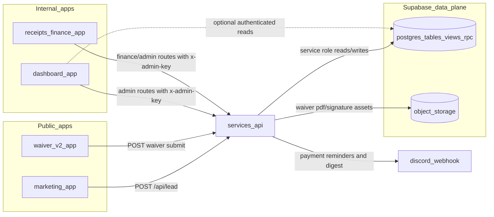
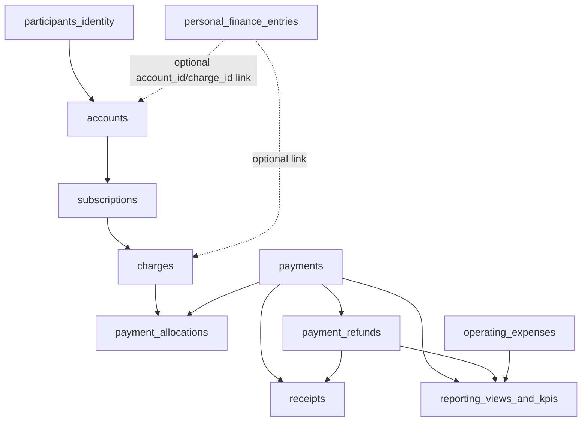

# Application ownership and data flow

This document is the high-level map of **all deployable applications**, who owns which data, and how data is created/read/updated across the platform.

## 1) Application inventory

From monorepo workspaces (`apps/*`, `services/*`):

- `apps/marketing` — public marketing and lead capture UI.
- `apps/waiver-v2` — participant waiver flow UI.
- `apps/dashboard` — internal operations and analysis UI.
- `apps/receipts` — internal finance/bookkeeping UI.
- `services/api` — operational API and integration boundary.
- `supabase` (Postgres, Storage, RLS, RPC, views) — system of record.

## 2) Ownership map (authoritative responsibilities)

| Layer | Owns | Must not own |
|------|------|--------------|
| `apps/marketing` | Lead form UX and public content rendering | Core billing tables, participant identity, receipts truth |
| `apps/waiver-v2` | Waiver collection UX | Direct privileged DB writes from browser |
| `apps/dashboard` | Admin workflows + read-model visualization | Becoming a second backend or source of truth |
| `apps/receipts` | Finance operator workflows and finance orchestration UX | Participant master identity, entitlement policy engine |
| `services/api` | Validated write orchestration, policy checks, integration workflows, notifications | Persisting app-only state that bypasses DB truth |
| Supabase | Canonical data storage, constraints, RLS, views, RPC contracts | UI decisions and presentation behavior |

## 3) End-to-end system diagram

## 4) Finance and billing data manipulation diagram

## 5) Write-path contract (how data is manipulated)

- Public lead flow: `marketing -> services/api -> marketing_leads`.
- Waiver flow: `waiver-v2 -> services/api -> waiver tables + storage artifacts`.
- Finance quick log flow: `receipts -> personal-finance endpoints -> personal_finance_entries`.
- Formal billing flow: `receipts/dashboard -> record-payment/refund/receipt endpoints -> payments + allocations + payment_refunds + receipts`.
- Expense flow: `receipts/dashboard -> operating-expenses endpoints -> operating_expenses`.
- Reporting flow: `dashboard/receipts -> reporting endpoints -> whitelisted views (read-only)`.

## 6) Read-path contract (who reads what)

- `apps/dashboard` reads KPIs and reporting views via API (and may perform limited direct authenticated DB reads where already implemented).
- `apps/receipts` reads payment board/reporting views via API to locate `account_id` / `charge_id`.
- `apps/marketing` and `apps/waiver-v2` should treat API responses as their data access boundary.

## 7) Guardrails for ownership and responsibility

- **Shared identity:** participants are mastered once; finance references identities/accounts instead of redefining them.
- **Application ownership:** finance app owns finance workflows but writes through API/RPC contracts, not arbitrary cross-app table writes.
- **Accounts over individuals:** payments post to `accounts`; person linkage is contextual.
- **Immutable receipt semantics:** corrections happen as void/supersede flows, not silent mutation of issued records.
- **Source of truth:** Supabase is authoritative for persisted operational and financial truth.

## 8) Practical implementation notes

- Use `services/api` as the mandatory write gateway for privileged actions.
- Keep public apps (`marketing`, `waiver-v2`) free from privileged database credentials.
- Keep reporting views as read models; avoid embedding accounting logic in frontend clients.
- Keep entitlement policy in its own domain; finance emits payment facts/events for downstream handling.
