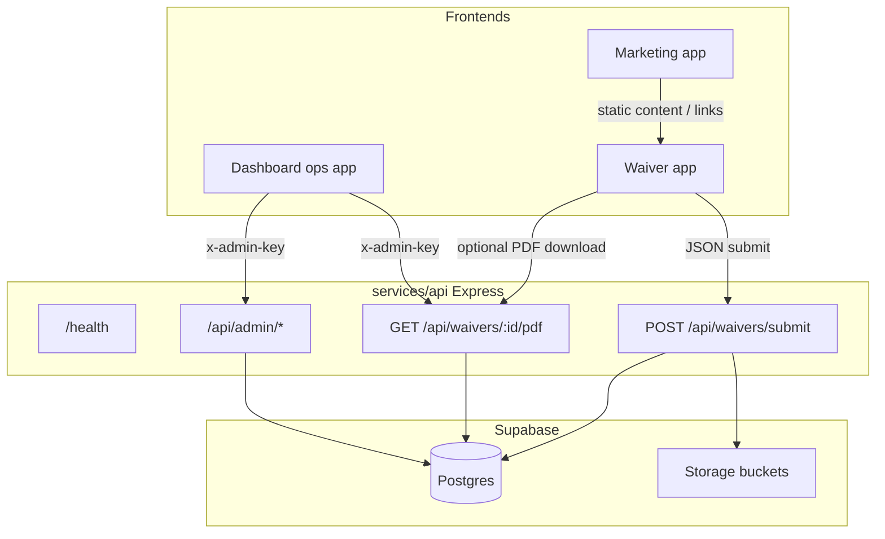
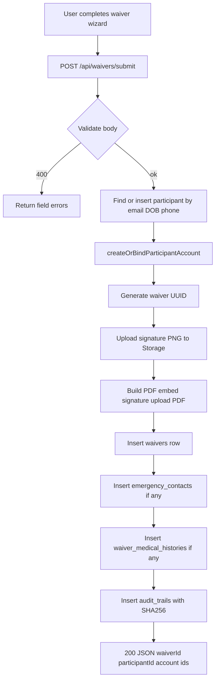
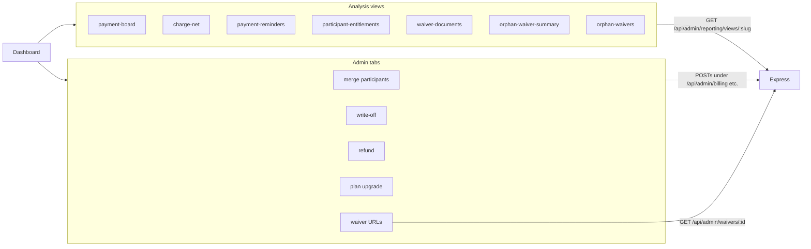

# Application breakdown (flowcharts)

## What this codebase is

| Layer | Location | Role |
|--------|----------|------|
| Marketing site | `marketing/TU-web` (sibling repo) | Vite + React Router: public pages, schedule/pricing, lead capture → `POST /api/lead`. |
| Waiver / signup | `TU-Signup` (sibling repo) | Single-page wizard (`WaiverPage`): personal info, medical, legal, review; optional household modes; posts JSON to the API. |
| Waiver review | `admin/apps/waiver-viewer` (sibling repo) | Mobile-first waiver review UI (Cloudflare Access). |
| Operations admin | `admin/apps/dashboard` (sibling repo) | API base URL + `x-admin-key` — reporting views and admin actions (merge, write-off, refund, upgrade, waiver URL lookup). |
| Finance operator | `admin/apps/receipts` (sibling repo) | Cash log, invoices, formal billing, share text. |
| Backend API | [`services/api`](../services/api) | Express (`services/api/src/index.js`): waiver submit, admin routes, PDF generation mounted under `/api/waivers`. |
| Data | [`supabase/migrations`](../supabase/migrations) | Postgres schema + RLS patterns; Storage buckets for signatures and signed PDFs (referenced in API code). |

Root scripts ([`package.json`](../package.json)): `dev` and `start` run the API. Dashboard, receipts, marketing, and waiver signup run from sibling repos.

---

## Chart 1 — High-level system architecture

---

## Chart 2 — Participant waiver submit flow (core "signup" path)

This matches the handler in [`services/api/src/index.js`](../services/api/src/index.js) (from validation through response).

---

## Chart 3 — Admin / operations flow

The dashboard sidebar (`admin/apps/dashboard`) drives two families of behavior:

Registered server routes include [`registerAdminBillingRoutes`](../services/api/src/routes/admin/billing.js), [`registerAdminParticipantRoutes`](../services/api/src/routes/admin/participants.js), and [`registerAdminReportingRoutes`](../services/api/src/routes/admin/reporting.js), all behind `requireAdmin` on [`/api/admin`](../services/api/src/index.js).

---

## Summary

- **Public funnel:** Marketing → (link) → Waiver app.
- **Core integration:** Waiver app → Express `POST /api/waivers/submit` → Supabase tables + Storage + account binding.
- **Back office:** `admin/apps/dashboard` and `admin/apps/receipts` (API key) → Express admin + reporting endpoints → same Supabase data.
