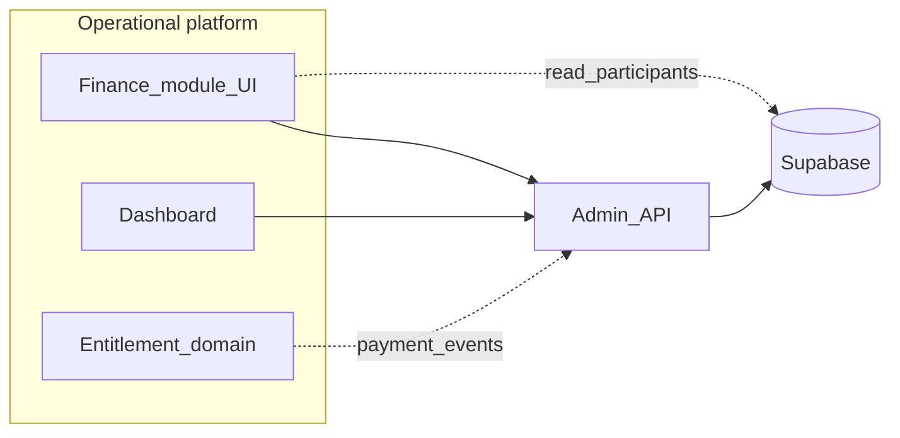
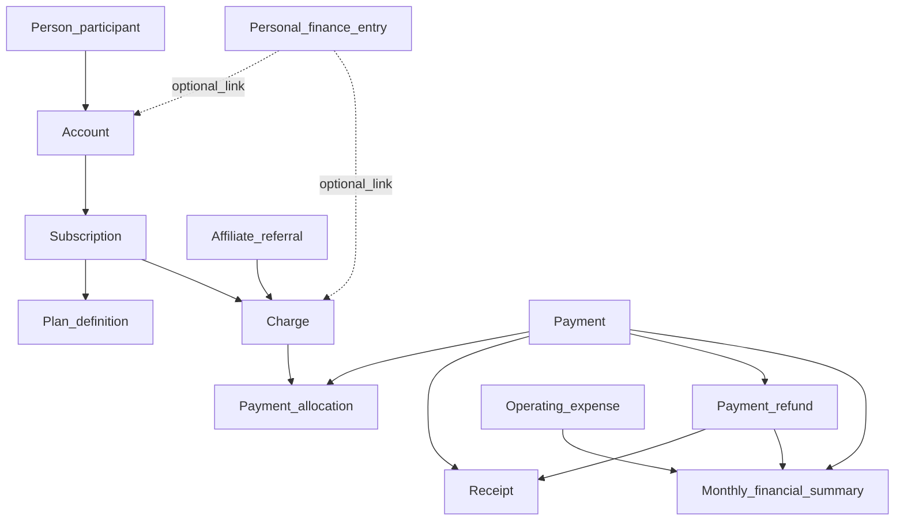

# Finance subsystem — design document

Temple Underground’s **finance subsystem** is a **private internal bookkeeping module** inside the broader operational platform. It is **not** a standalone customer product. **Supabase Postgres** is the **system of record**; the module surfaces workflows (for example via `admin/apps/receipts` and the admin API) and must respect **application ownership** and **identity** boundaries described below.

**Audience:** single trusted operator (initially one person).

**Related docs:** [receipts-app.md](./receipts-app.md) (current UI behavior), [admin-api.md](./admin-api.md) (contracts), [v1-v2-application-map.md](./v1-v2-application-map.md) (receipt lifecycle and platform context).

---

## 1. Purpose and positioning

### 1.1 Mission

Track and support operations for:

- **Income:** payments received, receipts issued, invoices sent, miscellaneous revenue.
- **Member billing:** recurring monthly plans, paper (pay-per) class revenue, discounts applied transparently on line items.
- **Shop expenses:** rent, utilities, equipment debt, and other operating outflows.
- **Sustainability view:** monthly **revenue vs expenses**, **operating delta**, and **deficit to cover** when the business is not self-sustaining from member cash alone; include **owner/family subsidy** context where recorded.

### 1.2 Non-goals

- Not a multi-tenant SaaS or public self-service billing product (V2 may add member pay links; this doc describes the subsystem, not full V2 scope).
- The finance UI does **not** redefine people or own participant master data.
- The finance subsystem does **not** write arbitrary rows into **another application’s** internal tables; it writes through **finance-owned tables** and **documented API / RPC / DB functions**.

### 1.3 Module placement

---

## 2. Principles and guardrails

### 2.1 Shared identity principle

- **People (participants) exist once** in Supabase-backed participant identity.
- Financial rows **reference** `participant_id` / `account_id` (and related IDs) as appropriate; they **do not duplicate** canonical name or profile as a second source of truth.
- **Participant lookup** is the default path for tying money to a member: **fuzzy search** over existing participants first; if no match, allow an **external counterparty** path (display name + optional contact notes) that still posts money to an **account** representing that payer relationship (see §3.5).

### 2.2 Application ownership principle

- The finance subsystem **owns** finance tables and finance-specific semantics (`payments`, `payment_allocations`, `receipts`, `personal_finance_entries`, `operating_expenses`, etc.).
- Cross-cutting writes (e.g. merge participants, billing RPCs) go through **existing service_role RPCs** or **admin API routes** documented in [admin-api.md](./admin-api.md)—not ad-hoc client writes from the finance app into foreign schemas.

### 2.3 Accounts over individuals principle

- A **person** is a human; an **account** is the **payer relationship** (billing anchor).
- **Payments belong to `accounts`**, not directly to persons. Paths from payment → person go through **account** (and subscription/charge linkage as modeled today).

### 2.4 Receipt and correction semantics (formal receipts)

Aligned with [v1-v2-application-map.md](./v1-v2-application-map.md) and migration `0014`:

- Issued receipt rows are **immutable** except void fields and notes (enforced in DB).
- **Corrections:** void → supersede / re-issue per product rules (see API void / refund receipt routes).
- **Refunds:** member money-out is modeled on **`payment_refunds`**, not as negative `charges`; money-out receipts link to refund rows.

### 2.5 Discount transparency

- Discounts are **modifications to priced items**, expressed as **explicit receipt line concepts** (percentage or flat amount). **Never** hide discounts inside a single “net” price without a visible discount line.

---

## 3. Domain model

### 3.1 Canonical entities

| Concept | Meaning | Primary persistence (today / direction) |
|--------|---------|----------------------------------------|
| **Person** | Human participant | `participants` (owned outside finance-only tables) |
| **Account** | Payer / billing anchor | `accounts` |
| **Subscription** | Recurring or per-session plan instance | `subscriptions` |
| **Plan definition** | Catalog price for basic / core / unlimited (example: $100 / $150 / $200) | `plan_definitions` (or equivalent catalog) |
| **Charge** | Amount owed for a period or class | `charges` |
| **Invoice (formal)** | Optional presentation/due artifact tied to charges | Can be UI + charge `due_at` / reporting; informal drafts in personal log |
| **Payment** | Money in succeeded | `payments` |
| **Allocation** | Payment applied to charges | `payment_allocations` |
| **Receipt** | Issued artifact (money in / money out) | `receipts` (`receipt_kind`, `payment_id`, optional `payment_refund_id`) |
| **Refund** | Money returned to member | `payment_refunds` |
| **Personal log entry** | Quick cash or draft invoice without UUIDs | `personal_finance_entries` |
| **Operating expense** | Shop cash out | `operating_expenses` |
| **Affiliate attribution** | Referrer / referred relationship | `affiliate_referrals` + billing RPCs (credits per admin-api) |
| **External counterparty** | Non-matched payer | Represented as **account** + display metadata (and/or personal log until linked) |

### 3.2 Relationship sketch

### 3.3 Two-layer money logging (current baseline)

| Layer | Storage | Use when |
|-------|---------|----------|
| **Personal log** | `personal_finance_entries` (`cash_received`, `invoice`) | Quick memory: name, amount, method; invoice drafts with `due_at` / `invoice_status`. |
| **Formal billing** | `payments`, `payment_allocations`, `receipts` | Allocations must hit real `charges`; official receipts; net due from `view_charge_net`. |

Personal rows may include optional `account_id` / `charge_id` when linking is desired ([receipts-app.md](./receipts-app.md)).

### 3.4 Catalog items and discounts (membership + class)

- **Items** align to plan definitions (e.g. basic $100, core $150, unlimited $200 per month)—exact IDs live in DB, not hardcoded in this doc.
- **Discounts** apply to a **line item** (plan or class fee): **percent** or **flat** off gross; on issuance, appear as **separate explicit lines** on the receipt narrative (implementation maps to stored rows or structured JSON as chosen in a later migration).

### 3.5 Participant lookup and external counterparty

1. **Search** existing participants (fuzzy match on name / phone / email as exposed by a dedicated API or Supabase RPC—implementation detail; requirement is **operator-first discovery**).
2. **If match:** resolve **default billing `account_id`** for that participant (or let operator pick among accounts if multiple).
3. **If no match:** create or select an **account** representing the counterparty (e.g. “Walk-in — {display name}” or one-off payer) without creating a duplicate **canonical person** when the real participant later appears—**merge** flows remain in participant ownership (`merge_participants` RPC per [admin-api.md](./admin-api.md)).

---

## 4. Current baseline capabilities (as implemented)

This maps existing surfaces to the subsystem vocabulary.

| Capability | Behavior | API / storage |
|------------|----------|---------------|
| Cash log | Log cash received, share/copy SMS-style text | `POST /api/admin/billing/personal-finance-entries` (`entry_kind: cash_received`) |
| Invoice drafts | Draft / sent / paid / void without formal charge row | `personal_finance_entries` (`entry_kind: invoice`), status route |
| Recent list | Review and transition invoice status | `GET` personal entries, `POST .../invoice-status` |
| Formal record payment | Succeeded payment + allocations + optional money-in receipt | `POST /api/admin/billing/record-payment` |
| Board lookup | Discover `account_id` / `charge_id` | `GET /api/admin/reporting/views/payment-board` |
| Void / refund receipts | Formal receipt lifecycle | `POST .../receipts/:id/void`, `POST .../receipts/issue-for-refund` |
| Operating expenses | Shop rent / utilities / other | `POST/GET /api/admin/billing/operating-expenses` |
| Refunds (member) | Shrinks allocations, updates statuses | `POST /api/admin/billing/payment-refunds` |

UI tabs in `admin/apps/receipts` mirror: Cash log, Invoice, Recent, Formal, Preview, Lookup, Void, Refund ([receipts-app.md](./receipts-app.md)).

**Explicit gap (documented):** personal **invoice** rows do not yet auto-create `charges`; linking draft → charge is a later automation ([receipts-app.md](./receipts-app.md)).

---

## 5. Core workflows

### 5.1 Monthly membership (target end-to-end)

1. **Create monthly charge** (subscription billing period)—via existing generation RPCs / admin processes (see [admin-api.md](./admin-api.md): `generate_monthly_charges`, etc.).
2. **Optional invoice** — informal: personal `invoice` entry with `due_at`; formal: charge `due_at` + comms.
3. **Receive payment** — `record-payment` with allocations until `view_charge_net` satisfied; charge → `paid`.
4. **Entitlements** — finance emits a **payment-confirmed event** (§7); entitlement service grants plan access (grace, pause, override live there).
5. **Issue receipt** — money-in receipt (`issue_receipt: true`); deliver copy by **email or SMS** (channel outside DB; content from share templates / future templates).
6. **Revenue logged** — represented by **`payments` + allocations** (and optional reporting rollups); personal log **not** required when formal path used.

### 5.2 Paper class (pay-per-class or walk-in)

1. **Context:** class attended without entitlement **or** paid in advance for intended attendance.
2. **Record charge** — e.g. `create_pay_per_class_charge` from attendance, or manual charge with correct `coverage_start` / `coverage_end` / `due_at` ([admin-api.md](./admin-api.md) backdating guidance).
3. **Receive payment** — `record-payment` against that charge (and same `account_id`).
4. **Issue receipt** — required for formal in-person payment when you want an artifact; same receipt rules as §2.4.

### 5.3 Discounts on items

1. Operator selects **plan or class line** (gross).
2. Applies **percent** or **flat** discount → **separate line** (negative amount or `discount` line type in presentation); **subtotal / discount / total** visible.
3. Persist in a way consistent with **`view_charge_net`** (affiliate credits already reduce net due today); manual **write-offs** use `charge-adjustments` ([admin-api.md](./admin-api.md)).

### 5.4 Expenses and sustainability

1. **Record operating expenses** — `operating_expenses`: `rent`, `utilities`, `other` (positive `amount_cents`); use `notes` / `vendor_name` for equipment debt detail until a dedicated category exists.
2. **Owner/family subsidy** — when a family member covers a shortfall: record as **context for monthly summary** (recommended: extend model with `owner_contribution` / `equity_injection` table or tagged `other` + machine-readable note in Phase 2 so KPIs stay clean).
3. **Monthly sustainability metrics** — see §6.

---

## 6. Financial summary and dashboard export contract

### 6.1 Default granularity

**Monthly totals only** for the default export (no required category drilldown in v1 of this contract).

### 6.2 Required fields (month `YYYY-MM`)

| Field | Definition |
|-------|------------|
| `month` | Calendar month (UTC boundary as agreed in implementation; document in API). |
| `revenue_cents` | Member and miscellaneous **cash in** for the month (net of refunds if using net cash; align with `view_analytics_revenue_waterfall_monthly` / `primary-kpis` definitions). |
| `expenses_cents` | Sum of `operating_expenses.amount_cents` with `expense_date` in month. |
| `operating_delta_cents` | `revenue_cents - expenses_cents`. |
| `deficit_to_cover_cents` | `max(0, expenses_cents - revenue_cents)` — “money the business still needs to be self-sustaining this month.” |
| `owner_subsidy_cents` | Optional; sum of recorded owner/family contributions that covered the gap (0 if not tracked). |

### 6.3 Export surface

- **Consumer:** dashboard (or server job) calls a **single documented endpoint** e.g. `GET /api/admin/finance/monthly-summary?month=YYYY-MM` (to be implemented; contract above is normative).
- **Cadence:** on-demand + optional nightly materialized refresh (implementation choice).
- **Source of truth:** aggregates computed from **Postgres** tables/views, not from client-only state.

---

## 7. Entitlements integration contract

Finance **does not** embed entitlement policy. It **emits** facts after money is settled.

### 7.1 Event: `finance.payment_settled` (conceptual)

Payload (minimum):

| Field | Description |
|-------|-------------|
| `event_id` | UUID (idempotency key for downstream). |
| `payment_id` | Succeeded payment. |
| `account_id` | Payer account. |
| `occurred_at` | When payment succeeded (`paid_at` or server time). |
| `allocations` | List of `{ charge_id, amount_cents }`. |
| `plan_context` | Derived read-only hint (e.g. subscription id / plan_definition_id) for entitlement service to interpret. |

### 7.2 Downstream responsibility

- **Entitlement service** (or worker subscribing to events / polling): grant, extend, or revoke **access** based on plan rules, grace, pauses, proration, overrides.
- **Retries:** downstream processing must be **idempotent** on `event_id` / `payment_id`.
- **Failures:** entitlement lag does not mutate payment truth; reconciliation is operational (replay, manual fix).

---

## 8. Data ownership and integration boundaries

### 8.1 Reads

- Participant search, charge net, payment board: **read** via API reporting routes or controlled queries ([admin-api.md](./admin-api.md) whitelisted views).
- Affiliate balances / applications: use existing RPCs and `view_charge_net` semantics—**do not** duplicate credit math in the finance UI long-term.

### 8.2 Writes

- **Member money:** `record-payment`, `payment-refunds`, `charge-adjustments`, billing RPCs.
- **Receipts:** issue, void, issue-for-refund.
- **Personal log:** personal-finance-entries + invoice status.
- **Shop money out:** operating-expenses.

### 8.3 Affiliate credits and discounts

- **Source of truth:** referral rows + billing RPCs (`record_payment_affiliate_credits`, `apply_credits_to_account`, balances per [admin-api.md](./admin-api.md)).
- **Finance module role:** display **applied** credits when building allocations and receipt text; **operator-authored** discounts remain explicit lines (§2.5).
- **Future:** affiliate “document” you maintain (who referred whom) feeds **`affiliate_referrals`** or merge tooling—finance reads, does not fork attribution truth.

---

## 9. Operational rules and controls

- **Operator model:** trusted device, `x-admin-key` only in secure contexts ([receipts-app.md](./receipts-app.md)).
- **`issued_by`:** display name text for receipts ([v1-v2-application-map.md](./v1-v2-application-map.md)).
- **Partial payments:** allocation sums ≤ payment amount and ≤ net due per charge ([admin-api.md](./admin-api.md)).
- **Event ledger:** receipt-related changes participate in configured `event_capture_config` (`0014`).
- **RLS:** finance tables use admin policies; service role used server-side only.

---

## 10. Implementation phasing (document-driven)

| Phase | Outcome |
|-------|---------|
| **1** | Vocabulary aligned across docs, UI copy, and API; personal vs formal paths clearly labeled in product. |
| **2** | Account-centric charge/payment flows wired for monthly + paper class; **payment-settled event** published to entitlements consumer; optional draft-invoice → charge linking design. |
| **3** | Affiliate-aware discount UX on top of existing credit math; **monthly summary** endpoint feeding dashboard cards. |

---

## 11. Acceptance checklist (this document)

- [x] Subsystem purpose, non-goals, and single-operator assumptions stated.
- [x] Shared identity, ownership, and accounts-over-individuals principles applied across workflows.
- [x] Domain model is account-centric; participant-first lookup + external counterparty path described.
- [x] Monthly membership, paper class, discount, and expense workflows described end-to-end.
- [x] Monthly-only default summary export contract specified.
- [x] Entitlements: event-driven handoff + idempotency expectations specified.
- [x] Affiliate integration scoped as read/apply from source of truth, not duplicated logic.
