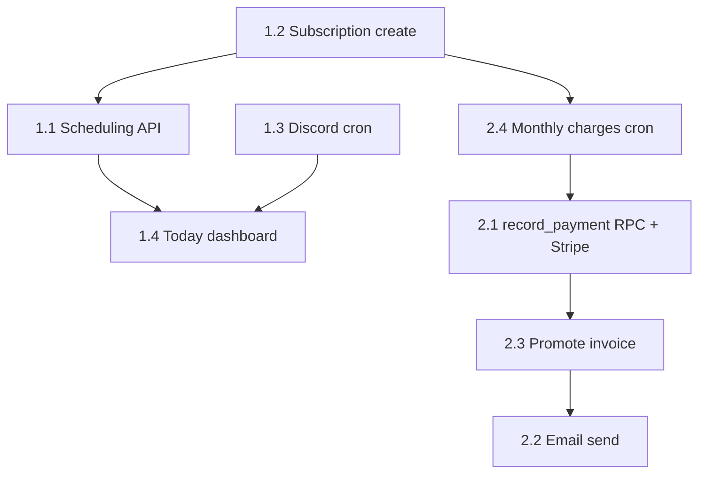

# Infrastructure additions checklist

**Purpose:** Turn the existing Postgres schema and admin API into daily staff workflows — without ad-hoc SQL.  
**Companion docs:** [api-capability-audit.md](./api-capability-audit.md), [admin-api.md](./admin-api.md), [api-schema-audit.md](./api-schema-audit.md), [finance-subsystem-design.md](./finance-subsystem-design.md).

**How to use this list**

- Work **top to bottom** within each tier unless a dependency forces reordering (e.g. subscription create before attendance billing).
- For every item, complete the **Definition of done** columns before checking it off.
- Prefer **API + RPC** for multi-table writes; add **migrations** only when the schema truly lacks something.
- After shipping API or schema changes, update [admin-api.md](./admin-api.md) and the `admin` repo frontend-design docs if contracts change.

**Legend**

| Column | Meaning |
|--------|---------|
| **Schema** | Migration / RPC / view in `supabase/migrations/` |
| **API** | Route in `services/api` (`x-admin-key`) |
| **Jobs** | Cron / worker / external scheduler (e.g. Render cron) |
| **UI** | Operator app (`admin/apps/dashboard`, `admin/apps/receipts`, or new app) |
| **Verify** | Smoke test or automated test |

---

## Baseline (already in repo — do not rebuild)

Use this as “done” context before starting new work.

| Area | Status |
|------|--------|
| Billing writes (payments, refunds, discounts, personal log, per-class from attendance) | API exists — see [admin-api.md](./admin-api.md) |
| Subscription **upgrade** / per-class → monthly | RPC + API exist; **subscription create** does not |
| Scheduling **reads** | `view_ops_today_sessions` + reporting slug `today-sessions` |
| Scheduling **writes** | **Not in API**; dashboard reads `sessions` via Supabase directly |
| Discord notifications | Routes exist; **no in-repo cron** calls them yet |
| Waiver → participant | `POST /api/waivers/submit` |
| `generate_monthly_charges()` | DB function exists; must be **scheduled or called manually** |

---

## Cross-cutting checklist (every infrastructure addition)

Apply these steps for **each** feature below, not only once at the end.

- [ ] **Contract** — Request/response shapes and `error` keys documented in [admin-api.md](./admin-api.md); match `{ ok: true }` / `{ ok: false, error: "..." }` envelope.
- [ ] **Auth** — Admin routes use `x-admin-key` only; no service-role key in Vite env except documented trusted cases.
- [ ] **Atomicity** — Multi-row writes go through a `service_role`-only RPC when partial failure would corrupt billing or attendance.
- [ ] **Event ledger** — Important writes should flow through tables/RPCs already captured by `event_ledger` triggers (or extend capture config if adding tables).
- [ ] **Money** — All amounts in **integer cents**; allocations respect `view_charge_net`.
- [ ] **Tests** — At least one API test or documented curl smoke for happy path + one failure path (`npm --workspace services/api run test`).
- [ ] **Ops** — Env vars on deployed API (Render/etc.): webhooks, Stripe secrets, cron auth if routes are hit by scheduler.
- [ ] **Live verify** — After migration: confirm applied version in Supabase Dashboard; update [api-schema-audit.md](./api-schema-audit.md) checklist if schema changed.

---

## Tier 1 — Unlock daily operations

### 1.1 Scheduling admin API (sessions + attendance)

**Goal:** Staff can create sessions and mark attendance without SQL or raw Supabase from the browser.

| Step | Schema | API | Jobs | UI | Verify |
|------|--------|-----|------|-----|--------|
| Design routes | — | — | — | — | [ ] Align names with [api-capability-audit.md § Phase 2](./api-capability-audit.md) |
| Create session | `sessions` (exists) | `POST /api/admin/scheduling/sessions` | — | — | [ ] Returns session id; validates times/label |
| Update / cancel session | `sessions` | `PATCH .../sessions/:id` | — | — | [ ] Cancel does not delete attendance history inappropriately |
| List / filter sessions | views optional | `GET .../scheduling/sessions` or reuse `today-sessions` for day scope | — | — | [ ] Date range + label filters |
| Upsert attendance | `attendance_records` | `POST .../sessions/:id/attendance` | — | — | [ ] Idempotent per participant+session; status enum validated |
| Optional: templates | `schedule_templates` | `POST .../scheduling/templates` | — | — | [ ] |
| Optional: generate from templates | RPC `generate_sessions` (new) | `POST .../scheduling/generate-sessions` | Cron later | — | [ ] Date range expansion tested |
| Entitlement guard | `can_attend_group_session` (exists) | Call RPC or mirror rules in route before `present` | — | — | [ ] Block or warn when not entitled (product decision) |

**UI follow-up (same tier):**

- [ ] Stop writing `sessions` / `attendance_records` from dashboard Supabase client; call admin API instead.
- [ ] Wire `today-sessions` view on a single **Today** page with actions (check-in, add walk-in).

**Definition of done:** Operator can run a class night end-to-end: session exists → roster checked in → `view_ops_today_sessions` reflects counts → optional `charge-from-attendance` still works when `attendance_record_id` exists.

---

### 1.2 Subscription create API (participant + plan + dates)

**Goal:** Enroll a member on a plan without SQL; unlock billing and attendance rules.

| Step | Schema | API | Jobs | UI | Verify |
|------|--------|-----|------|-----|--------|
| Design enrollment contract | `subscriptions`, `plan_definitions`, `accounts`, `account_members` | — | — | — | [ ] Fields: `participant_id`, `plan_definition_id`, `starts_at`, `ends_at` optional, `account_id` or create/bind account |
| RPC (recommended) | `create_subscription(...)` new migration | Wrap in route | — | — | [ ] One transaction: account link if needed, subscription row, optional initial charge |
| Admin route | — | `POST /api/admin/billing/subscriptions` (name TBD) | — | — | [ ] Validates plan active, date overlap rules, single active plan per product rules |
| Initial charge policy | `charges` | Same RPC or separate flag | — | — | [ ] Document: create first monthly charge or defer to `generate_monthly_charges` |
| Event ledger | triggers on `subscriptions` | — | — | — | [ ] Enrollment appears in ledger |

**Definition of done:** New member path = waiver (or participant) → **API enrollment** → active subscription visible in entitlement views → monthly charges can generate.

---

### 1.3 Cron job for Discord notifications

**Goal:** Payment reminders and daily digest run without someone POSTing manually.

| Step | Schema | API | Jobs | UI | Verify |
|------|--------|-----|------|-----|--------|
| Confirm routes | views exist | `POST .../notifications/discord/daily-digest`, `.../payment-reminders` | — | — | [ ] `DISCORD_WEBHOOK_URL` set on API service |
| Scheduler auth | — | Optional: `CRON_SECRET` header check on notification routes | Render cron (or pg_cron) | — | [ ] Unauthenticated public cannot trigger spam |
| Schedule digest | — | — | [ ] Daily cron → digest route | — | [ ] Message appears in Discord test channel |
| Schedule reminders | — | — | [ ] Cron for overdue/due-soon (product cadence) | — | [ ] Uses `view_member_payment_reminders` |
| Optional: personal invoices | `personal_finance_entries` | New route for `invoice_status = sent` + `due_at` | Cron | — | [ ] See [receipts-app.md](./receipts-app.md) |

**Definition of done:** For 7 days, cron fires on schedule; failures logged; no duplicate spam (idempotency or “last run” marker if needed).

---

### 1.4 Single “Today” dashboard page (reads + API writes)

**Goal:** One front-desk screen: who’s coming, who’s here, what’s blocked, quick actions.

| Step | Schema | API | Jobs | UI | Verify |
|------|--------|-----|------|-----|--------|
| Read bundle | views exist | `GET` reporting: `today-sessions`, `upcoming-access-issues`, `waiver-compliance-gaps` (optional) | — | — | [ ] One page loads all slugs |
| Write actions | — | Scheduling + attendance routes (1.1) | — | `admin/apps/dashboard` route `/today` | [ ] Check-in from UI hits API |
| Remove direct Supabase writes for scheduling | — | — | — | [ ] SessionsPage migrated or deprecated | [ ] |
| KPI strip | `view_primary_kpi_summary` | Existing finance summary optional | — | [ ] Active monthly count, AR hint | [ ] |

**Definition of done:** Operator opens **Today** only for a typical class night; no SQL; attendance and session state match `view_ops_today_sessions`.

---

## Tier 2 — Reduce manual friction

### 2.1 Stripe + webhook → record payment

| Step | Schema | API | Jobs | UI | Verify |
|------|--------|-----|------|-----|--------|
| Harden core | RPC `record_payment` (if not done) | Refactor `POST .../record-payment` to RPC | — | — | [ ] Atomic payment + allocations + receipt |
| Stripe objects | optional `payment_processor_refs` table | — | — | — | [ ] Store `payment_intent` / `charge` id |
| Webhook route | — | `POST /api/webhooks/stripe` (signature verify) | — | — | [ ] Idempotent on event id |
| Map to billing | `payments`, allocations | Call `record_payment` RPC | — | — | [ ] Test mode end-to-end |
| Operator UX | — | — | — | Receipts: “paid via Stripe” indicator | [ ] |

**Definition of done:** Test payment in Stripe Dashboard → webhook → payment row + allocations + receipt; duplicate webhook does not double-allocate.

---

### 2.2 Email for receipts / invoices

| Step | Schema | API | Jobs | UI | Verify |
|------|--------|-----|------|-----|--------|
| Provider | — | Env: SendGrid/Resend/etc. | — | — | [ ] |
| Templates | — | Shared render from receipt/invoice text | — | Receipts “Email” button | [ ] |
| Route | optional send log table | `POST .../billing/receipts/:id/send-email` | — | — | [ ] Does not replace share-sheet |
| Personal invoices | `personal_finance_entries` | `POST .../personal-finance-entries/:id/send` | — | Invoice tab | [ ] |

**Definition of done:** Operator sends formal receipt email; member receives correct amount and reference ids.

---

### 2.3 Promote personal invoice → formal charges

| Step | Schema | API | Jobs | UI | Verify |
|------|--------|-----|------|-----|--------|
| Design | `charges` link to `personal_finance_entries` optional | — | — | — | [ ] See [finance-subsystem-design.md](./finance-subsystem-design.md) Phase 2 |
| RPC | `promote_personal_invoice_to_charge(...)` | `POST .../personal-finance-entries/:id/promote` | — | Receipts | [ ] Draft → charge when participant/account known |
| Status sync | both tables | — | — | — | [ ] Personal row marked promoted; no double charge |

**Definition of done:** Invoice draft with known participant becomes a real `charges` row billable via existing payment flows.

---

### 2.4 Monthly charge generation job

Often forgotten because schema exists but nothing calls it.

| Step | Schema | API | Jobs | UI | Verify |
|------|--------|-----|------|-----|--------|
| Callable path | `generate_monthly_charges()` | `POST /api/admin/billing/generate-monthly-charges` (admin or cron secret) | Daily cron | — | [ ] Log count created |
| Docs | — | — | — | — | [ ] [use-guide.md](./use-guide.md) updated |

---

## Tier 3 — Scale and polish

### 3.1 Member portal / pay links

- [ ] Auth model (magic link, Supabase Auth member role, or processor customer portal)
- [ ] Read-only: own charges, receipts, subscription status
- [ ] Pay link generation (Stripe Checkout / Payment Link) tied to `charge_id`
- [ ] No service-role key in browser; public routes rate-limited

### 3.2 RBAC (beyond one admin key)

- [ ] Role table or Supabase Auth custom claims (`owner`, `front_desk`, `finance`)
- [ ] Route middleware maps roles → allowed actions
- [ ] Audit: `actor_id` on sensitive writes (ledger already supports `actor_type`)

### 3.3 Class catalog, capacity, waitlist

- [ ] Schema: `class_offerings`, `session_capacity`, `waitlist_entries` (or extend `sessions`)
- [ ] API: enroll, cancel, promote from waitlist
- [ ] Marketing site: optional DB-backed schedule instead of static `site.ts`

### 3.4 Accounting export

- [ ] Reporting view or `GET .../export/general-ledger?start=&end=`
- [ ] CSV: charges, payments, allocations, refunds, expenses
- [ ] Document mapping to QuickBooks / external accountant format

---

## Suggested delivery order (dependencies)



1. **Subscription create (1.2)** — unblocks enrollment before attendance billing rules matter.  
2. **Scheduling API (1.1)** — unblocks Today page writes.  
3. **Discord cron (1.3)** — small, independent win.  
4. **Today dashboard (1.4)** — composes 1.1 + reads.  
5. **Monthly charges job (2.4)** — before Stripe, so recurring billing is automated.  
6. **Stripe + atomic record_payment (2.1)** — then promote invoice and email.

---

## Quick verification commands

```bash
npm install
npm run dev:api
npm --workspace services/api run test
# from admin repo
npm run dev:dashboard
npm run dev:receipts
```

After migrations: `npm run supabase:push` (linked project) and update [api-schema-audit.md](./api-schema-audit.md).

---

*Last updated: 2026-06-01. Tier list aligned with product priority; technical gaps sourced from [api-capability-audit.md](./api-capability-audit.md).*
