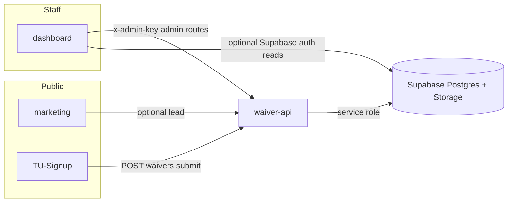

# V1 vs V2 — Application map, expectations, and open questions

This document defines how the monorepo is structured, what “done” means at a high level for each deployable piece, how they fit together, and what remains to decide before implementation (especially **receipts** and **notifications**).

**Locked product decisions (from stakeholder input):**

- **Receipts:** See **§6** — **money-in** receipt ties to the payment; **corrections** void + clone + edit; **refunds** void original + issue **money-out** receipt; all steps emit **event ledger** entries. (`issued_by` = **display name**.)
- **V1:** Helpful operator tools + **single area of truth** in the database; staff trigger payments/receipts first; **member-facing pay links** are **V2**.
- **Notifications (V1):** **Discord** as primary channel; **due soon** and **overdue** are the main triggers; **one staff Discord channel** receives alerts.
- **Affiliate / referral:** **Required** for V1 launch (views / billing visibility).
- **Staff access:** **Supabase email + password** acceptable for V1 (single operator initially); still follow normal app security (HTTPS, secrets, admin key hygiene).
- **Backfill:** **None** — empty DB, no succeeded payments; receipts **forward-only** from implementation onward.
- **Daily digest (Discord):** **In scope for V1** — configurable (e.g. morning roll-up). **Pinned for later:** extra behavior such as “refresh digest when a new participant gets a paying account” — not blocking other V1 work.
- **Marketing leads:** **V1 target — backend lead capture** (store leads so you can review them in-app or export); discount/pricing strategy can follow once systems are stable; **mailto-only** is not the long-term path.
- **V2 theme:** Automation and more autonomous flows (self-service pay, richer automation).

---

## 1. Deployable applications (inventory)

**This repo** (`TU-API`):

| # | Workspace | Package name | Role |
|---|-----------|--------------|------|
| 1 | `services/api` | `waiver-api` | Express: waiver submit, PDF routes, **admin API** (billing RPCs, reporting, service role). |

**Sibling repos:**

| Repo | Workspace | Role |
|------|-----------|------|
| `TU-Signup` | (repo root) | Participant-facing digital waiver wizard → API. |
| `marketing` | `TU-web` | Public marketing site (schedule, pricing, contact/trial, SEO). |
| `admin` | `apps/dashboard` | Staff console: auth + read views + admin actions via `x-admin-key`. |
| `admin` | `apps/receipts` | Operator finance tool: cash log, invoices, formal billing. |
| `admin` | `apps/waiver-viewer` | Cloudflare-Access waiver review UI. |

Root scripts (this repo): `dev:api`; `start` runs the API only.

---

## 2. Purpose and “done” criteria by application

### 2.1 Marketing (`marketing/TU-web`)

| | |
|--|--|
| **Purpose** | Prospects: credibility, schedule/pricing, lead capture. |
| **V1 done** | Deployed; accurate copy; **backend lead capture** (form → API → persisted leads) so you can see leads in the system; mailto acceptable only as interim while wiring. |
| **V2 done** | Real lead pipeline (CRM/email/backend), analytics, sitemap/production hardening as needed. |

### 2.2 Waiver (`TU-Signup`)

| | |
|--|--|
| **Purpose** | Capture legal/medical/emergency data + signature; persist via API (no direct Supabase from browser). |
| **V1 done** | Submit works end-to-end; storage + participant/waiver rows; content version tracked. |
| **V2 done** | Stronger PDF/legal workflow, UX/a11y, optional member portal, i18n completeness. |

### 2.3 Dashboard (`admin/apps/dashboard`)

| | |
|--|--|
| **Purpose** | **Visual** command surface: what’s missing, what’s due, current KPIs; thin client over admin API + optional direct Supabase reads where implemented. |
| **V1 done** | Trustworthy views for money and membership health; access to documented admin flows; **not** required to replace every Supabase Dashboard task. |
| **V2 done** | Richer UX, permissions, fewer “paste admin key” patterns, deeper workflows. |

### 2.4 API (`services/api`)

| | |
|--|--|
| **Purpose** | **Source of operational truth** for writes: waivers, billing RPCs, reporting over whitelisted views, future **record payment + issue receipt**, future **notification** triggers. |
| **V1 done** | Env complete; health checks; waiver + admin routes match `docs/admin-api.md`; **receipt + record payment** admin flow implemented when billing V1 is declared complete. |
| **V2 done** | Webhooks (e.g. payment provider), background jobs, rate limits, member-facing payment links, heavier automation. |

---

## 3. How the pieces work together

- **Waiver:** Browser → API only → Postgres + Storage.
- **Dashboard:** Admin actions → API with `x-admin-key`; analysis/KPIs may call reporting endpoints that use service role.
- **Marketing:** Mostly static; **lead form** should `POST` to the API (same-origin or reverse proxy) so leads are **stored**, not only mailto.

---

## 4. V1 MVP — what we are expecting (summary)

| Area | V1 expectation |
|------|----------------|
| **People** | Participants exist; waiver path complete enough for production. |
| **Money** | Charges, payments, allocations, refunds path documented and usable; **receipt** lifecycle per **§6**; **staff-triggered** record payment + issue receipt; **affiliate/referral** visible for launch. |
| **Truth** | Database is authoritative; reporting views and KPIs reflect the same numbers. |
| **Dashboard** | More **visual** than operational: highlights gaps (e.g. compliance, payment risk) and current state; heavy admin remains optional. |
| **Notifications** | **Quality-of-life** alerts (Discord / Telegram / WhatsApp) driven by **API + scheduled jobs**, not by dashboard polling. |
| **Event log** | Ledger captures key billing events; **receipt issuance** should be added to capture config when `receipts` table exists. |
| **Leads** | Marketing submissions **saved** in DB (or equivalent) for V1 so you can review them. |

---

## 5. V2 MVP — direction (not a contract yet)

| Theme | V2 direction |
|-------|----------------|
| **Payments** | Member-facing payment links; provider webhooks; less manual staff entry. |
| **Automation** | Reminders, dunning, retries, autonomous flows where safe. |
| **Dashboard** | Deeper workflows, permissions, less reliance on raw tables. |
| **Notifications** | Broader channels; may include SMS if justified. |

---

## 6. Receipts — design target (forward migration, not yet implemented)

### Principles

- After issue, a receipt row is **immutable** (no in-place edits to “live” fields).
- If a receipt **must be rewritten** (correction): **void** the original → **clone** its data → allow edits on the **new** draft → re-issue; **event ledger** records this as a **new** operation (not a silent update).
- **`issued_by`:** **Display name** (text), suitable for a single operator today; staff expansion later does not change this rule.

### Money in vs money out (dashboard + refunds)

- **First issue (money in):** receipt represents **money in** for a **succeeded** payment.
- **Partial or full refund:** **void** the original (money-in) receipt (void flag + optional note) → issue a **new** receipt showing **money out**, aligned with refund records in the DB, with **supplemental note** on the money-out receipt when needed.
- The dashboard should make **money in** vs **money out** clear from stored rows and void state.

**Schema note:** A strict **single row per `payment_id`** is insufficient once void + re-issue and **separate money-out receipts** exist. Implementation will likely use e.g. **`receipt_kind`** (`money_in` | `money_out_refund` | `money_out_correction`) and/or links to **`payment_refunds`**, plus **`supersedes_receipt_id` / void flags**, while keeping **audit** in **event_ledger**.

### Storage and source

- Document storage (e.g. bucket + path or URL + content type).
- `source`: `staff_triggered` | `member_link` (V2).

### Event ledger

- Add `receipts` to **`event_capture_config`** and extend capture so **void**, **clone/correct**, and **money-out issue** produce distinct, explainable events (e.g. `receipt.voided`, `receipt.created`, `receipt.superseded` — exact names TBD in migration).

### Backfill

- **None required** — no historical succeeded payments; behavior starts when the feature ships.

---

## 6b. Money in vs money out — charges, current schema, or a new entity?

There are **two different meanings** of “money out.” They should **not** both be forced into `charges`.

### A) Member-related money out (refunds)

- **Tracked by the existing schema:** `payment_refunds` (and the refund RPC that shrinks `payment_allocations`).
- **Charges** stay **what members owe** (receivables). A refund is **not** “a negative charge” in the same row; it is money returning **out** relative to a **`payment`**.
- **Reporting:** Monthly cash already uses **`refunded_cents`** vs collections (e.g. revenue waterfall). Receipts for **money out** should **link to** `payment_refunds` (or the payment + refund line) so the dashboard matches accounting intent.

**Answer:** For refunds, **use the current tables** (`payments`, `payment_refunds`, allocations). **Do not** model refunds as ordinary `charges` unless you introduce a dedicated convention (usually worse than using `payment_refunds`).

### B) Business operating expenses (rent, utilities, and similar)

- **Not modeled** in the current member billing schema. `charges` are **member billing**, not your **shop rent** or **electric bill**.
- **Answer:** Treat this as its **own entity** (e.g. `operating_expenses` / `business_expenditures` with `category`, `amount_cents`, `paid_at`, vendor, optional attachment). Optionally a future unified “cash” view **joins** member cash (payments/refunds) with business cash (expenses) for your own P&L — but keep **member** and **shop** lines separate at the row level.

### Summary

| Flow | Mechanism |
|------|-----------|
| Money in (dues, class fees) | `payments` → `payment_allocations` → `charges` |
| Money out to **members** (refund) | **`payment_refunds`** (+ receipts per **§6**) |
| Money out for **rent / utilities** | **New entity** (expenses), not `charges` |

---

## 7. Product decisions recorded (stakeholder answers)

| Topic | Decision |
|-------|----------|
| Receipt immutability | Yes; corrections = **void → clone → edit → re-issue**; ledger records the operation. |
| Refunds | **Void** original money-in receipt; **new** money-out receipt; optional notes; supplemental note on money-out when needed. |
| `issued_by` | **Display name**. |
| Backfill | **Not required** (empty DB). |
| Notifications channel | **Discord** (primary). |
| Notification triggers | **Due soon** + **overdue** (primary). |
| Recipients | **One** staff Discord channel. |
| Affiliate / referral | **Required** for V1 launch (views). |
| Marketing lead capture | **V1 — backend capture** (see glossary); review leads in-app / export; discount campaigns can layer on once stable. |
| Daily digest | **V1 — yes**, configurable (e.g. Discord morning summary). **Pinned:** digest/update rules tied to “new paying participant” — implement after core billing/notifications. |
| Staff auth | **Supabase email + password** OK for V1; single user initially; still secure the app (HTTPS, keys, RLS). |

---

## Glossary (terms we used)

**Daily digest**  
A **single scheduled message** (e.g. once per morning) that **batches** what needs attention (due soon, overdue, optional summaries). **Instant** alerts (due soon / overdue as they happen) are separate. **V1:** configurable digest is **in scope**. **Pinned for later:** e.g. refresh or append digest when a **new participant** gets a **paying account** — nice to have, not a blocker.

**Marketing lead capture**  
When someone fills out **“Contact us” / “Book a trial”** on the **marketing** site, **lead capture** means the submission is **stored in your backend** (Postgres via API) so you can **list and review leads** in the dashboard or admin tools. **mailto-only** does not store leads. **V1 decision:** implement **backend capture**; use leads later for **discounts / campaigns** once billing is stable.

---

## 8. Next implementation steps

1. **Forward migration:** `receipts` (and related enums/links) matching **§6**, including void/supersession and money-out linkage to refunds.
2. **Admin API:** Record payment + issue receipt; void/clone/correct; refund-driven money-out receipt.
3. **Event ledger:** Wire `receipts` into capture + explicit events for void/correct/out.
4. **Dashboard:** Visual money-in / money-out + void state (per your wording).
5. **Discord:** Bot or webhook + job that evaluates **due soon** / **overdue** (from existing reporting views or queries); add **daily digest** scheduling as configured.
6. **Marketing:** `POST /api/lead` (or equivalent) + `leads` table + dashboard list (minimal V1).
7. **Operating expenses (rent/utilities):** forward migration for **business money out** (separate from `charges`); optional V1 if you want shop P&L in-app, else V2.
8. **Docs:** `docs/admin-api.md` + validation SQL as needed.

---

## Appendix — Reference docs

- Admin API: [`docs/admin-api.md`](admin-api.md)
- Phase 2 ops views: [`docs/phase2-high-impact-views.md`](phase2-high-impact-views.md)
- Phase 3 analytics: [`docs/phase3-analytics-views.md`](phase3-analytics-views.md)
